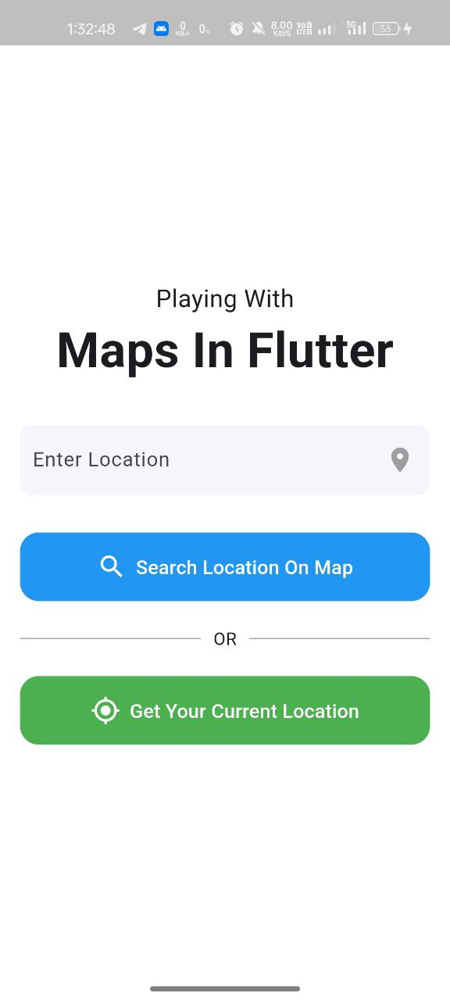
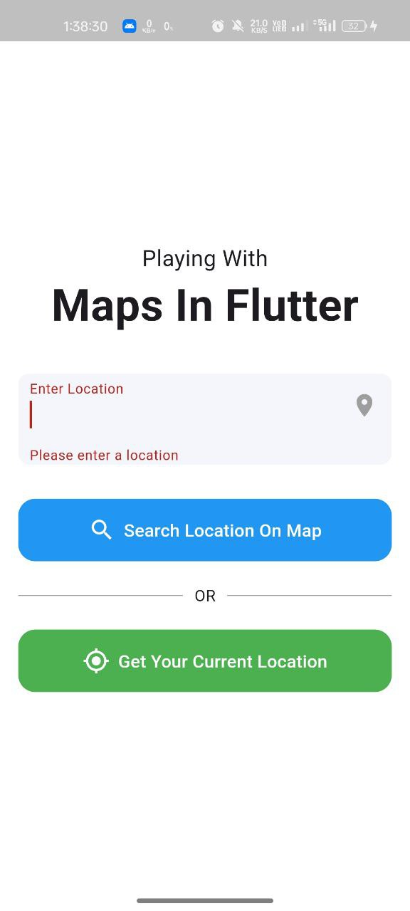
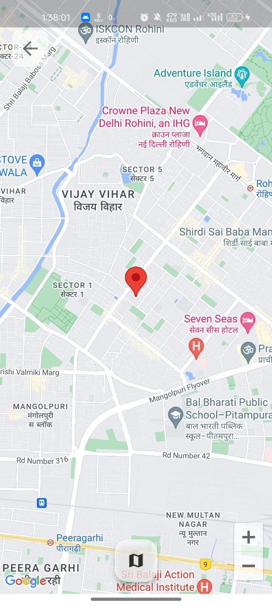

This is a Flutter application that allows users to input a location and display it on a map, or get their current location and show it on the map. The app integrates Google Maps and uses the geolocator package for handling location services.

Table of Contents

    SnapShots
    Features
    Requirements
    Setup Instructions
    Get Google Maps API Key
    Configure Google Maps API Key
    Running the App

## App Screenshot

Features

    Location Search: Users can search for a location by name (e.g., city, address) and view it on Google Maps.
    Current Location: Users can get their current location and view it on the map with a marker.
    Google Maps Integration: The app displays maps using the google_maps_flutter package.

Requirements

    Flutter SDK: Ensure you have Flutter installed. If not, follow the instructions here.
    Android Studio or Xcode: You'll need either Android Studio for Android development or Xcode for iOS development.
    Google Maps API Key: You will need a Google Maps API key to use Google Maps services.

Setup Instructions

1. Clone the Repository

First, clone the repository to your local machine:

git clone https://github.com/your-username/your-repo.git
cd your-repo

2. Install Dependencies

Run the following command to install the necessary dependencies:

flutter pub get

3. Get a Google Maps API Key

To integrate Google Maps into the app, you will need to obtain a Google Maps API key.
How to Get a Google Maps API Key:

    Go to the Google Cloud Console.
    Create a new project (or select an existing project).
    In the left navigation menu, click APIs & Services and then Credentials.
    Click on Create Credentials and select API Key.
    Copy the generated API key.

Make sure the following APIs are enabled for your project:

    Maps SDK for Android
    Maps SDK for iOS

To enable these APIs:

    In the Google Cloud Console, go to APIs & Services > Library.
    Search for "Maps SDK for Android" and "Maps SDK for iOS".
    Enable each API.

4. Configure Google Maps API Key
For Android

    Open android/app/src/main/AndroidManifest.xml.
    Add the following inside the <application> tag, replacing YOUR_API_KEY with your actual API key:
     
    android:name="com.google.android.geo.API_KEY"
     android:value="YOUR_API_KEY"

5. Running the App

To run the app, use the following command for either Android or iOS:

flutter run
